# 薪酬激励分配系统 · Spec 修订与模块优先级（2026-05-11）

> **本文档是对 `2026-05-07-salary-incentive-system-design.md` 的增量修订，不替换原 spec。**
> 原 spec 1054 行保持有效，本文件以"决策 + diff + 优先级"形式记录 5 大业务确认及随之而来的模型/流程调整，作为 Phase 2 标准化重构与 Phase 3 阶段性开发计划的输入。

---

## 0. 文档地图

| 章节 | 用途 | 读者 |
|------|------|------|
| §1 决策记录 | 5 大业务决策 + 3 条附加规则的最终结论与理由 | 业务负责人确认 |
| §2 spec 修订清单 | 按原 spec 章节列出"删除 / 新增 / 修改" | Claude 在重构时对照执行 |
| §3 完整 ER 图 | 决策落地后的核心实体关系（Mermaid） | 双方对齐数据结构 |
| §4 模块优先级表 | 10 个 app 的开发顺序 + 阻塞关系 | 排迭代用 |
| §5 余下未决项 | gap 审计中尚未拍板的次要差异 | 后续按需逐条处理 |

---

## 1. 决策记录

### 1.1 决策 1 · 部门预算分级下发（dimension = 4）

**结论**：调薪/RSU 预算池在公司层就已切到部门粒度，HR 直接维护"周期 × 类型 × 一级类目 × 部门"的预算单元。

**模型变更**：`AdjustmentBudgetCell` 唯一约束从 `(cycle, kind, category_l1)` 改为 `(cycle, kind, category_l1, department)`，新增 `department_id` 外键。

**理由**：
- 公司从来不发"全公司大盘子让各部门去抢"，每年开盘前已分到部门。
- 集团强管控、部门在下发盘子内分配——这是软预算约束的硬底线。
- 之前 spec §3.4 的三维 cell 把"按部门切"挪到了运行时计算，导致部门负责人看不到自己实际被授予的盘子。

**已落代码**：`backend/apps/compensation_plan/migrations/0003_add_department_dimension.py` + `models.py` 已加 `department` 字段（git status 显示未提交）。

---

### 1.2 决策 2 · 一池子员工侧 + 多池子财务侧

**结论**：年终奖在员工侧只展示一个金额（不区分子类型），但在公司/部门盘子层保留多池子结构，供 HR 与部门负责人感知"钱从哪来"。

**模型变更**：

| 层级 | 模型 | 说明 |
|------|------|------|
| 公司 | `BonusSubtypeBudget`（新） | 子类型级预算池：年终奖、专项奖、明星奖…按 `(cycle, subtype)` 维护 |
| 部门 | `BonusBudget`（保留） | 部门年终奖总额一行，多带一个 `subtype_breakdown` JSONB 字段 = `{"AGM":80000,"SPECIAL":20000,...}`，仅作显示用 |
| 员工 | `BonusProposal` | **去掉子类型字段**，只有 `amount` 一个金额 |

**软约束规则**：
- 子类型池子超额：仅警告，不阻塞。
- 部门总额超额：阻塞 + 必填超额说明。
- 公司总额：硬约束（HR 兜底）。

**理由**（用户原话）："预算池只是在部门分配时区分，起到告知部门负责人资源来源的作用，员工层面不需要知道奖金怎么来。"

---

### 1.3 决策 3 · 完整三年总包测算 + 机动盘保留

**结论**：采用完整 `TotalCompSnapshot`（Y-1 / Y / Y+1 三年所有字段，40+ 列），由分配页 onSave 增量重算。

**附加规则 · 机动盘**：
- `AdjustmentBudgetCell` 增三字段：`reserve_budget`（部门负责人手动调节额度）、`auto_allocated`（HR 初始建议规则消耗）、`manual_used`（机动盘已用）。
- **`机动盘 = total_budget - auto_allocated`**：HR 系数下发时 8w 自动分到人，2w 留给部门内部调节。
- 校验逻辑：
  - 在 reserve 内随便调；
  - 超 reserve 但不超 total → 通过（机动盘吃掉自动盘空闲）；
  - 超 total → 弹警告 + 必填超额说明，仅记录不阻塞，HR 在汇总页一次性裁决。

**理由**（用户原话）："机动盘其实是预算池定下来后其中的可调节部分。"

---

### 1.4 决策 4 · CENTER_HEAD 常驻角色 + 字段级 grant（替代委托模型）

**结论**：彻底删除原 spec 的 `PermissionDelegation` 4 状态委托工作流，改为：

1. **CENTER_HEAD 是常驻系统角色**，默认拥有"现金分配权限"——年终奖 + 调薪 + 对应字段。
2. RSU 字段对默认 CENTER_HEAD **不展现**（页面 + API 双重过滤）。
3. 部门负责人可签发 `FieldPermissionGrant` 给某个中心负责人，把 RSU 相关字段加入其可见集，等同于部门负责人的字段权限。
4. **数据范围硬约束**：任何 grant 都不能扩范围——CENTER_HEAD 永远只看自己中心的成员，不存在"被授权看更多中心"的情况。

**模型变更**：

```
PermissionDelegation（4 状态：DRAFT/PENDING/ACTIVE/REVOKED）  ❌ 删除
↓
FieldPermissionGrant（2 状态：ACTIVE/REVOKED）  ✅ 新增
- granter_id (部门负责人 user_id)
- grantee_id (中心负责人 user_id)
- center_id   (被授权范围限定为该中心)
- extra_fields (JSONB, e.g. ["rsu_grant_amount","rsu_vesting_schedule"])
- status, created_at, revoked_at
- 唯一约束 (grantee, center) where status=ACTIVE
```

**SystemRole 增加常驻角色**：
- `HR_ADMIN`、`DEPT_HEAD`、`CENTER_HEAD`、`GROUP_LEAD`、`EMPLOYEE`、`FINANCE`、`AUDITOR`

**理由**（用户原话）："不是委托的概念，而是默认中心负责人有现金分配权限……不能被授权看到更多本中心之外的信息。"

---

### 1.5 决策 5 · 5 级灵活组织树 + 兼任表

**结论**：组织层级固定 5 级 = 集团 → 部门(分公司) → 中心 → 组 → 员工，但**中心层与组层都是可选的**——有些组织以独立中心存在，有些组织规模小直接挂到组。

**模型变更**：

1. `OrgUnit.unit_type` 枚举加固：`GROUP_HQ` / `DEPARTMENT` / `CENTER` / `TEAM`（组）/ `EMPLOYEE_LEAF`，`parent_id` 自引用支持任意跳级。
2. 新增 `OrgUnitManager`（多对多兼任表）：
   ```
   - org_unit_id  (FK → OrgUnit)
   - manager_id   (FK → User)
   - role_in_unit (DEPT_HEAD / CENTER_HEAD / GROUP_LEAD)
   - is_primary   (boolean, 一个 unit 可有 1 主 + N 兼任)
   - effective_from / effective_to
   ```
3. 数据权限解析：`DataScopedQuerysetMixin` 在过滤员工时，对当前 user 取并集——他主管的所有 OrgUnit 子树。

**理由**（用户原话）："中心负责人、部门负责人都可能出现兼任情况。"

---

### 1.6 附加横切规则汇总

| 规则 | 落地点 |
|------|--------|
| 软预算约束（除部门总额外都不阻塞，只警告 + 留痕） | `AdjustmentProposal.over_budget_reasons` JSONB |
| 数据范围硬约束（grant 永不扩范围） | `FieldPermissionGrant` 模型校验 + `DataScopedQuerysetMixin` |
| 字段级 grant 通过 enum 白名单（不允许任意字段） | `FieldPermissionGrant.extra_fields` 校验器 |
| 审批留痕：approved_at / over_budget_reasons / promoted_level_band_bucket | `AdjustmentProposal` 补字段 |

---

## 2. spec 修订清单（diff 风格）

> 标记规则：**[+]** 新增，**[-]** 删除，**[~]** 修改，**[!]** 重写。

### 2.1 §3.1 iam（账号与组织）

- **[~]** `SystemRole.code` 枚举补全：`HR_ADMIN, DEPT_HEAD, CENTER_HEAD, GROUP_LEAD, EMPLOYEE, FINANCE, AUDITOR`。`CENTER_HEAD` 不再是临时委托产物。
- **[-]** 删除 `PermissionDelegation` 表（含 DRAFT/PENDING/ACTIVE/REVOKED 4 状态及对应工作流）。
- **[+]** 新增 `FieldPermissionGrant`（见 §1.4）。
- **[+]** 新增 `OrgUnitManager`（见 §1.5）。
- **[~]** 字段级权限不再走 RBAC permission 表，而是通过：① 角色基线字段集（CENTER_HEAD 默认现金字段集），② 叠加 `FieldPermissionGrant.extra_fields`。

### 2.2 §3.2 hr_master（员工与薪酬档案）

- **[~]** `OrgUnit.unit_type` 枚举改为 5 级（见 §1.5）；中心、组层均可缺省，`parent_id` 支持跨级跳。
- **[+]** Employee 与 OrgUnit 的归属表保留单 FK（员工只属于一个最末端 unit），员工跨多个上级单元的可见性由上级树聚合解决。

### 2.3 §3.4 compensation_plan（调薪 / RSU 调整）

- **[~]** `AdjustmentBudgetCell`：唯一约束加 `department_id`（已在 0003 迁移落地）。
- **[+]** `AdjustmentBudgetCell` 加 `reserve_budget`、`auto_allocated`、`manual_used`（见 §1.3）。
- **[+]** `AdjustmentProposal` 补字段：`promoted_level_band_bucket`（晋升档位桶，原 spec 已暗示但未建模）、`approved_at`（终审时间戳）、`over_budget_reasons`（JSONB，软超额说明）。
- **[~]** §4.5 分配页列规格中"预算余额"列 = `total_budget - auto_allocated - manual_used`，颜色规则按机动盘三段判定。

### 2.4 §3.5 bonus_pool（年终奖）

- **[!]** 重写为三层模型：
  - `BonusSubtypeBudget(cycle, subtype, amount)` 公司层 [+]
  - `BonusBudget(cycle, department, total_amount, subtype_breakdown JSONB)` 部门层 [~]
  - `BonusProposal(employee, amount, ...)`，**移除 subtype 字段** [-]
- **[~]** §4.1 年终奖流程：HR 维护子类型池子→部门盘子（含 breakdown 显示）→部门负责人/中心负责人按总盘分配单一金额→子类型超额不阻塞、总额超额阻塞。

### 2.5 §3.6 lti（RSU 长期激励）

- **[~]** RSU 字段集按角色显隐：默认 CENTER_HEAD 不可见，部门负责人可签 `FieldPermissionGrant` 把 `rsu_*` 字段加入。
- **[~]** §4.2 RewardCycle 流程文案中"提案默认含 RSU"改为"含 RSU 取决于当前 user 字段权限并集"。
- **[+]** 字段集白名单需登记：`RSU_FIELD_GROUP = ["rsu_grant_amount","rsu_vesting_schedule","rsu_unvested_value", ...]`。

### 2.6 §3.7 reward_cycle / §3.11 TotalCompSnapshot

- **[~]** `RewardCycle.config` 新增 `total_comp_config` 子节，定义三年快照需要的字段映射（来自 hr_master / lti / bonus_pool / data_integration）。
- **[+]** `TotalCompSnapshot` 字段全集（Y-1 / Y / Y+1，按 cash / equity / benefit 三栈），onSave 增量重算，避免 N+1。

### 2.7 §3.8 approval（审批引擎）

- **[~]** `ApprovalChainTemplate.nodes` 由自由 JSON 改为类型化 schema：
  ```json
  {
    "node_id": "n1",
    "type": "ROLE",  // ROLE / USER / ORG_HEAD / FINANCE_DESK
    "role_code": "DEPT_HEAD",
    "scope_expr": "proposal.org_unit.department",
    "is_optional": false
  }
  ```
- **[~]** `scope_expr` 用受限 DSL（白名单字段），禁止任意 Python eval。

### 2.8 §3.9 audit（独立 schema）

- **[~]** `AuditLog.db_table` 修复成 `audit"."log`（schema-qualified），原 spec 的 ` "audit_log" ` 命名导致迁移会落到 public schema。
- **[+]** `AuditLog` 关联字段补 `field_grant_id` 替代原 `delegation_id`。

### 2.9 §4.3 权限授权流程（中心授权）· 重写

- **[!]** 原"4 状态委托工作流"全部删除。
- **[+]** 新流程：
  1. 系统初始化时 CENTER_HEAD 角色已绑定 `RSU_FIELD_GROUP` 之外的现金字段集。
  2. 部门负责人在【组织 → 我的中心负责人】页面，对某个 CENTER_HEAD 勾选"开放 RSU 字段"。
  3. 立即生效，无审批；部门负责人可随时撤销（status=REVOKED）。
  4. 所有 grant 写入 audit 流。

### 2.10 §4.5 分配页列规范（UI 事实源）

- **[~]** §4.5.1 年终奖列表头：删除"子类型"列，新增"奖金总额"+ tooltip 显示 subtype_breakdown。
- **[~]** §4.5.2 调薪列：增"机动盘可用 / 已用 / 总额"三列。

### 2.11 §5 权限模型补充

- **[+]** §5.6 新增"数据范围硬约束"：所有 ORM 查询通过 `DataScopedQuerysetMixin`，权限校验顺序 = 数据范围（硬）→ 字段集（软可扩）→ 行级 mask。
- **[~]** §5.3 resource_grants 改名 `field_grants`，明确仅作字段级扩展。

---

## 3. 完整 ER 关系图（Mermaid）

```mermaid
erDiagram
    %% IAM
    USER ||--o{ USER_ROLE : has
    SYSTEM_ROLE ||--o{ USER_ROLE : assigned_to
    USER ||--o{ ORG_UNIT_MANAGER : manages
    ORG_UNIT ||--o{ ORG_UNIT_MANAGER : managed_by
    USER ||--o{ FIELD_PERMISSION_GRANT : grants_as_granter
    USER ||--o{ FIELD_PERMISSION_GRANT : receives_as_grantee
    ORG_UNIT ||--o{ FIELD_PERMISSION_GRANT : scoped_to_center

    %% HR Master
    ORG_UNIT ||--o{ ORG_UNIT : parent_of
    ORG_UNIT ||--o{ EMPLOYEE : contains
    USER ||--|| EMPLOYEE : identity
    EMPLOYEE ||--o{ COMP_PROFILE : has
    EMPLOYEE ||--o{ LTI_HOLDING : holds

    %% Reward Cycle
    REWARD_CYCLE ||--o{ ADJUSTMENT_BUDGET_CELL : budgets
    REWARD_CYCLE ||--o{ BONUS_SUBTYPE_BUDGET : budgets
    REWARD_CYCLE ||--o{ BONUS_BUDGET : budgets
    REWARD_CYCLE ||--o{ ADJUSTMENT_PROPOSAL : drives
    REWARD_CYCLE ||--o{ BONUS_PROPOSAL : drives
    REWARD_CYCLE ||--o{ TOTAL_COMP_SNAPSHOT : produces

    %% Compensation Plan
    ORG_UNIT ||--o{ ADJUSTMENT_BUDGET_CELL : department_dim
    ADJUSTMENT_BUDGET_CELL ||--o{ ADJUSTMENT_PROPOSAL : constrains
    EMPLOYEE ||--o{ ADJUSTMENT_PROPOSAL : subject
    USER ||--o{ ADJUSTMENT_PROPOSAL : proposed_by

    %% Bonus Pool
    BONUS_SUBTYPE_BUDGET ||--o{ BONUS_BUDGET : aggregated_to_dept
    ORG_UNIT ||--o{ BONUS_BUDGET : department
    BONUS_BUDGET ||--o{ BONUS_PROPOSAL : constrains
    EMPLOYEE ||--o{ BONUS_PROPOSAL : subject

    %% LTI
    EMPLOYEE ||--o{ LTI_GRANT : awarded
    LTI_GRANT ||--o{ LTI_VESTING_SCHEDULE : has
    REWARD_CYCLE ||--o{ LTI_ADJUSTMENT_PROPOSAL : drives

    %% Approval
    APPROVAL_CHAIN_TEMPLATE ||--o{ APPROVAL_INSTANCE : instantiates
    APPROVAL_INSTANCE ||--o{ APPROVAL_NODE_RUN : runs
    USER ||--o{ APPROVAL_NODE_RUN : actor
    ADJUSTMENT_PROPOSAL ||--o{ APPROVAL_INSTANCE : triggers
    BONUS_PROPOSAL ||--o{ APPROVAL_INSTANCE : triggers

    %% Audit
    USER ||--o{ AUDIT_LOG : actor
    FIELD_PERMISSION_GRANT ||--o{ AUDIT_LOG : referenced_by

    USER {
        bigint id PK
        string username
        string email
        bool mfa_enabled
        bool is_active
    }
    SYSTEM_ROLE {
        string code PK "HR_ADMIN/DEPT_HEAD/CENTER_HEAD/GROUP_LEAD/EMPLOYEE/FINANCE/AUDITOR"
        jsonb base_field_set
    }
    ORG_UNIT {
        bigint id PK
        bigint parent_id FK
        string unit_type "GROUP_HQ/DEPARTMENT/CENTER/TEAM/EMPLOYEE_LEAF"
        string name
        string code UK
    }
    ORG_UNIT_MANAGER {
        bigint id PK
        bigint org_unit_id FK
        bigint manager_id FK
        string role_in_unit
        bool is_primary
        date effective_from
        date effective_to
    }
    FIELD_PERMISSION_GRANT {
        bigint id PK
        bigint granter_id FK
        bigint grantee_id FK
        bigint center_id FK
        jsonb extra_fields "RSU_FIELD_GROUP whitelist"
        string status "ACTIVE/REVOKED"
        timestamptz created_at
        timestamptz revoked_at
    }
    EMPLOYEE {
        bigint id PK
        bigint user_id FK
        bigint org_unit_id FK
        string emp_no UK
        date hire_date
        string level_band
        string position_grade
    }
    REWARD_CYCLE {
        bigint id PK
        string name
        int year
        string status "DRAFT/OPEN/LOCKED/CLOSED"
        jsonb config "含 total_comp_config"
    }
    ADJUSTMENT_BUDGET_CELL {
        bigint id PK
        bigint cycle_id FK
        string kind "SALARY/RSU"
        string category_l1
        bigint department_id FK
        decimal total_budget
        decimal reserve_budget
        decimal auto_allocated
        decimal manual_used
    }
    ADJUSTMENT_PROPOSAL {
        bigint id PK
        bigint cycle_id FK
        bigint employee_id FK
        string kind
        decimal proposed_amount
        string promoted_level_band_bucket
        jsonb over_budget_reasons
        timestamptz approved_at
        string status
    }
    BONUS_SUBTYPE_BUDGET {
        bigint id PK
        bigint cycle_id FK
        string subtype "AGM/SPECIAL/STAR/..."
        decimal amount
    }
    BONUS_BUDGET {
        bigint id PK
        bigint cycle_id FK
        bigint department_id FK
        decimal total_amount
        jsonb subtype_breakdown "display only"
    }
    BONUS_PROPOSAL {
        bigint id PK
        bigint cycle_id FK
        bigint employee_id FK
        decimal amount
        string status
    }
    TOTAL_COMP_SNAPSHOT {
        bigint id PK
        bigint cycle_id FK
        bigint employee_id FK
        jsonb cash_y_minus_1
        jsonb cash_y
        jsonb cash_y_plus_1
        jsonb equity_y_minus_1
        jsonb equity_y
        jsonb equity_y_plus_1
        jsonb benefit_y
        timestamptz computed_at
    }
    APPROVAL_CHAIN_TEMPLATE {
        bigint id PK
        string code UK
        jsonb nodes "typed schema"
    }
    APPROVAL_INSTANCE {
        bigint id PK
        bigint template_id FK
        string subject_type
        bigint subject_id
        string status
    }
    AUDIT_LOG {
        bigint id PK
        bigint actor_id FK
        string action
        string target_type
        bigint target_id
        bigint field_grant_id FK
        jsonb diff
        timestamptz created_at
    }
```



> 完整字段以原 spec §3 为准；本图只列影响决策结果的核心实体。

---

## 4. 模块优先级表

按"业务价值密度 × 阻塞关系 × 现有骨架成熟度"排序。优先级越靠前的越早进入冲刺。

| # | App | 角色 | 优先级 | 阻塞关系 | 当前骨架成熟度 | 备注 |
|---|-----|------|--------|----------|----------------|------|
| 1 | iam | 账号 / RBAC / 字段权限 / 兼任 | **P0** | 阻塞所有业务 app | 已有 5 系统角色 + JWT，需加 `FieldPermissionGrant`、`OrgUnitManager`、删 `PermissionDelegation` | 决策 4 + 5 直接落地点 |
| 2 | hr_master | 员工 / 组织树 / 薪酬档案 | **P0** | 阻塞 cycle / plan / bonus | OrgUnit/Employee 已建，需把 unit_type 升 5 级 | 决策 5 落地点 |
| 3 | reward_cycle | 周期对象 + TotalCompSnapshot | **P1** | 阻塞 plan / bonus / lti 提案 | RewardCycle 已建，TotalCompSnapshot 待补 | 决策 3 落地点 |
| 4 | compensation_plan | 调薪 + 机动盘 | **P1** | 阻塞分配页 / 审批 / 报告 | 已加 department 维度（0003 待提交），机动盘三字段待补 | 决策 1 + 3 落地点；MVP 垂直切片首选 |
| 5 | bonus_pool | 年终奖三层模型 | **P1** | 与 plan 并列，但 MVP 二选一可推迟 | 当前是单池模型，需重写 | 决策 2 落地点 |
| 6 | approval | 类型化 chain + scope DSL | **P2** | plan/bonus 上线前必须就位（提案→审批） | 模型已建，nodes 仍是自由 JSON，需类型化 | 与 plan/bonus 并行起 |
| 7 | audit | 独立 schema 审计流 | **P2** | 合规上线前必须就位 | db_table 命名待修，与 grant 关联待补 | 跟 iam 一起改 |
| 8 | lti | RSU 调整 / vesting | **P2** | RewardCycle 合并场景才用 | 模型已建，字段权限隐藏待加 | 字段集对接 iam |
| 9 | data_integration | HR / 财务系统对接 | **P3** | MVP 用 Excel 导入即可 | 仅骨架 | 与外部系统联调期再深做 |
| 10 | notification / report | 通知 + 看板 | **P3** | 业务流程跑通后再补 | 仅骨架 | 不阻塞 MVP |

**MVP 垂直切片建议**：iam → hr_master → reward_cycle → compensation_plan（调薪场景）→ approval（最简单一条审批链）→ 分配页 §4.5.2。bonus_pool 紧随其后作为第二个垂直切片。

**阶段化交付（呼应原 spec §8）**：

- **Sprint 0（已完成）**：5 commit、10 app 骨架、27 测试、portal/nginx/E2E smoke。
- **Sprint 1（本周起，约 1.5 周）**：iam + hr_master 决策落地（FieldPermissionGrant / OrgUnitManager / 5 级 unit_type）。
- **Sprint 2（约 1.5 周）**：compensation_plan 机动盘 + AdjustmentProposal 补字段 + 调薪分配页。
- **Sprint 3（约 2 周）**：approval 类型化 + 一条调薪审批链跑通 + audit 修复。
- **Sprint 4（约 2 周）**：bonus_pool 三层模型重写 + 年终奖分配页。
- **Sprint 5（约 2 周）**：reward_cycle.TotalCompSnapshot + 合并场景（调薪 & RSU）。
- **Sprint 6（约 2 周）**：lti 字段权限 + RSU 流程 + 通知 / 报告占位。
- **Sprint 7+**：data_integration + 报告完善 + 性能 / 合规收口。

总时长估计仍是 MVP 12–14 周、完整系统 17–20 周，与 spec §8 一致。

---

## 5. 余下未决项

下列条目来自 gap 审计但未触及 5 大决策，按"低成本可批量解决"的方式处理：

| # | 类型 | 描述 | 处理建议 |
|---|------|------|----------|
| 1 | 漏项 | `EmployeeFreeze`（员工冻结：试用期/离职流转期不可调薪） | 进 hr_master，Sprint 1 末顺手加 |
| 2 | 漏项 | `BonusCoefficient`（年终奖系数表，按职级 × 绩效） | 进 bonus_pool，Sprint 4 |
| 3 | 漏项 | `LevelBand` / `PositionGrade` 字典 | 进 hr_master，Sprint 1 |
| 4 | 漏项 | `Holiday` / `WorkingCalendar`（用于 prorate） | 进 hr_master 或独立 dict app，Sprint 2 |
| 5 | 漏项 | `CurrencyRate`（多币种换算） | 进 data_integration 或 hr_master.dict，Sprint 5 |
| 6 | 漏项 | `BonusFormulaTemplate`（公式模板：基薪 × 系数 × 月数 × prorate） | 进 bonus_pool，Sprint 4 |
| 7 | 漏项 | `MfaChallenge`（MFA 挑战记录） | 进 iam，Sprint 1 |
| 8 | 漏项 | `SessionRevocation`（JWT 黑名单） | 进 iam，Sprint 1 |
| 9 | 模糊 | "晋升档位桶"枚举到底有哪些值 | 待 HR 业务方提供，Sprint 2 决策 |
| 10 | 模糊 | RSU vesting schedule 的标准 schema | 与 LTI 实操对照，Sprint 6 |
| 11 | 模糊 | TotalCompSnapshot 的"未来一年" Y+1 假设规则（晋升预期？） | 写入 reward_cycle.config 配置，Sprint 5 |
| 12 | 模糊 | 审批 SLA / 提醒规则 | 进 notification，Sprint 6 |
| 13 | 模糊 | 报告导出权限范围 | 进 report，Sprint 7 |
| 14 | 不一致 | `Employee.position_grade` 与 `level_band` 关系 | 由 hr_master.dict 统一定义，Sprint 1 |
| 15 | 不一致 | Cycle 状态机：spec 写 4 态、代码 3 态 | 以 spec 为准，Sprint 3 矫正 |
| 16 | 不一致 | `BonusProposal.amount` 精度（spec 没写小数位） | 全表统一 `Decimal(14,2)`，Sprint 4 |
| 17 | 不一致 | `OrgUnit.code` 是否唯一（spec 暗示，代码未约束） | 加 unique 约束，Sprint 1 |
| 18 | 不一致 | 审计字段命名 `actor_id` vs `operator_id` | 统一 `actor_id`，Sprint 3 |
| 19+ | … | 其他 17 条次要差异 | 滚动到对应 Sprint 顺手处理 |

> 这 35 条来自 Phase 1 gap 审计，前 18 条已挂到具体 Sprint，19+ 在执行 Sprint 时回看清单挑相关的吃掉。

---

## 6. 下一步

1. 你 review 本文档（特别是 §1 决策与 §4 优先级），有偏差直接告诉我哪条要改。
2. review 通过后，我进入 **writing-plans** 阶段，为 Sprint 1（iam + hr_master 标准化重构）写实施计划，作为 Phase 2 / Phase 3 的第一份可执行落地文档。
3. Sprint 1 计划 review 通过后开始写代码、跑测试、提交。
